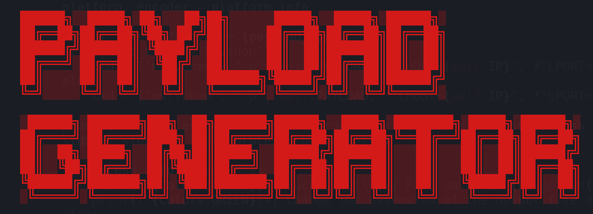
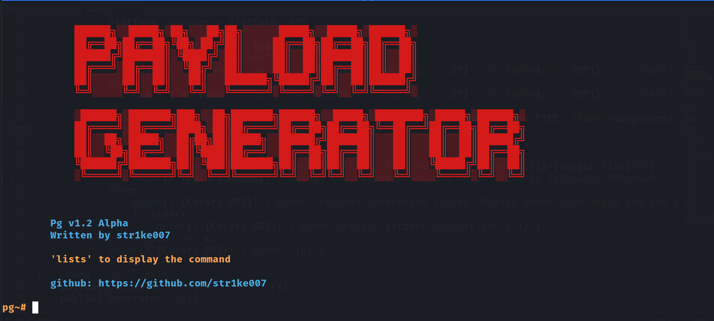
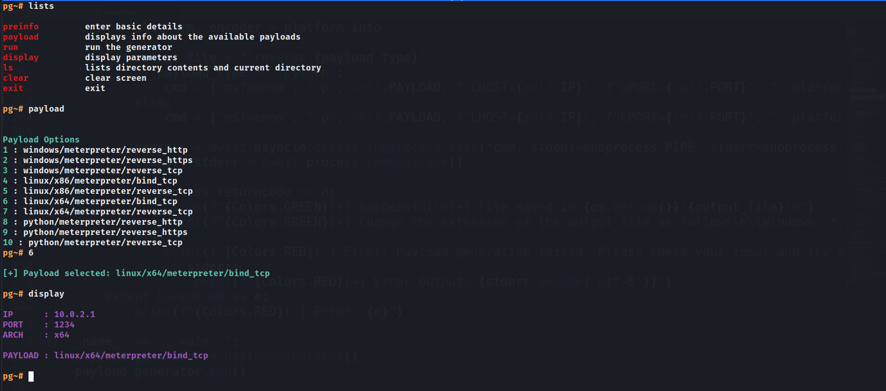

<h1 align="center">
  Payload Generator - Pg v1.2 Alpha
</h1>

<p align="center">
  
  
  
</p>

<p align="center">
  
</p>

<h2>About</h2>

The Payload Generator, also known as Pg v1.2 Alpha, is a powerful and creative tool designed to generate various payloads for penetration testing and ethical hacking purposes. Developed by the skilled hacker, str1ke007, this tool empowers security professionals and enthusiasts to craft customized payloads with ease.

<h2>Features</h2>

- Choose from a wide range of available payloads for Windows and Linux platforms.
- Seamless selection of payload options through the user-friendly command-line interface.
- Generate payloads with custom IP and port configurations to suit your specific needs.
- Effortlessly switch between x86 and x64 architectures to target your desired system.
- Asynchronous programming ensures responsive user interaction while payloads are generated in the background.
- Cross-platform compatibility allows the Payload Generator to run smoothly on Windows, macOS, and Linux systems.

<h2>Getting Started</h2>

To start using the Payload Generator, follow these simple steps:

1. Clone the repository:

```bash
git clone https://github.com/str1ke007/payload-generator.git
```

2. Navigate to the project directory:

```bash
cd payload-generator
```

3. Run the Payload Generator:

```bash
python3 payload_generator.py
```

<h2>Screenshots</h2>
<p align="center">
  
</p>
<p align="center">
  
</p>
<p align="center">
  
</p>
<p align="center">
  
</p>
<h2>Contributing</h2>

Contributions to the Payload Generator project are welcome! Whether you want to fix a bug, add new features, or improve the documentation, feel free to open a pull request. Please make sure to follow the project's coding guidelines and best practices.
<h2>License</h2>

This project is licensed under the MIT License.
<h2>Contact</h2>

For any inquiries or feedback, you can reach out to the project creator, str1ke007, on GitHub.
<p align="center">
  <a href="https://github.com/str1ke007" target="_blank">
    
  </a>
</p>
